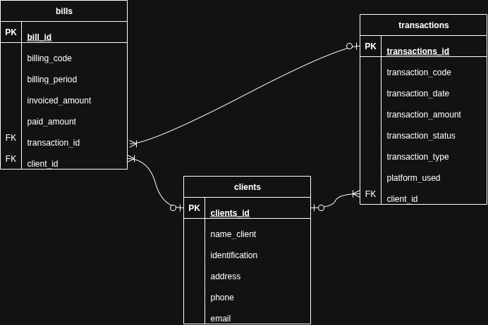

# Performance_test_M4

This project was developed for ExpertSoft, a Colombian software company specialized in solutions for the electrical sector.

The client faced difficulties managing financial information from Fintech platforms such as Nequi and Daviplata, as the data was scattered across multiple disorganized Excel files (.xlsx).

The implemented solution organizes, structures, and stores this information in a SQL relational database, enabling bulk data loading, complete CRUD operations, and advanced queries to meet business requirements.

A minimal frontend dashboard allows basic management of one of the database entities.

---

# Technologies Used

* Node.js
* Express.js
* csv-parser (to load data from CSV files)
* dotenv
* MySQL
* Vite (for the frontend)

---

## Project Structure
```bash
Performance_test_M4/
│
├── backend/
│   └── server/
│       ├── data/
│       │   ├── 01_clients.csv
│       │   ├── 02_transaction.csv
│       │   ├── 03_bills.csv
│       │   └── data.xlsx
│       ├── docs/
│       │   ├── ER_ExpertSoft.drawio.png
│       │   └── script.sql
│       ├── seeders/
│       │   ├── load.service.js
│       │   └── run_seeders.js
│       ├── .env
│       ├── connections_db.js
│       └── index.js
├── frontend/
│   ├── css/
│   │   └── styles.css
│   └── js/
│       └── main.js
├── .gitignore
├── index.html
├── package-lock.json
├── package.json
├── Performance_test_M4.postman_collection.json
├── README.md
└── vite.config.ts
```
---

## Installation

1.  Clone the repository:
```bash
    git clone <YOUR_REPOSITORY_URL>
    cd Performance_test_M4
```
2.  Install backend dependencies:
```
    cd backend/server
    npm install
```
3.  Install frontend dependencies:
```
    cd ../../frontend # To return to the project root if you are in backend/server
    npm install
```

4.  Load initial data (seeds):
```
    cd backend/server # Make sure you are in this folder
    npm run seeds
```
5.  Initialize the backend:
```
    node backend/server/index.js
```
6.  Initialize the frontend:
    Open a new terminal in the Performance_test_M4/ project root and run:
```
    npm run dev
```
---

## Database Documentation

### Database Name

Performance_test_M4

---

### Entity-Relationship Diagram



---

### Tables

#### **clients**

| Field               | Data type      | Constraints                         | Description                             |
| :------------------ | :------------- | :---------------------------------- | :-------------------------------------- |
| client_id          | INT            | PRIMARY KEY AUTO_INCREMENT        | Unique client identifier                |
| name_client        | VARCHAR(255)   | NOT NULL                          | Client's name                           |
| identification      | VARCHAR(50)    | UNIQUE NOT NULL                   | Unique client identification            |
| address             | VARCHAR(255)   |                                     | Client's address                        |
| phone               | VARCHAR(50)    |                                     | Client's phone number                   |
| email               | VARCHAR(255)   | UNIQUE NOT NULL                   | Client's email address                  |

---

#### **transactions**

| Field                 | Data type      | Constraints                                   | Description                                 |
| :-------------------- | :------------- | :-------------------------------------------- | :------------------------------------------ |
| transaction_id       | INT            | PRIMARY KEY AUTO_INCREMENT                  | Unique transaction identifier               |
| transaction_code     | VARCHAR(50)    | UNIQUE NOT NULL                             | Unique transaction code                     |
| transaction_datetime | TIMESTAMP      | NOT NULL                                    | Transaction date and time                   |
| transaction_amount   | DECIMAL(10, 2) | NOT NULL                                    | Transaction amount                          |
| transaction_status   | ENUM           | "Fallida", "Completada", "Pendiente"        | Transaction status                          |
| transaction_type     | VARCHAR(50)    | NOT NULL                                    | Type of transaction                         |
| platform_used        | VARCHAR(100)   |                                               | Platform used (e.g., Nequi, Daviplata)      |
| client_id_fk        | INT            | FOREIGN KEY REFERENCES clients(client_id)   | Foreign key referencing the client          |

---

#### **bills**

| Field                 | Data type      | Constraints                                     | Description                                 |
| :-------------------- | :------------- | :---------------------------------------------- | :------------------------------------------ |
| bill_id              | INT            | PRIMARY KEY AUTO_INCREMENT                    | Unique bill identifier                      |
| bill_code            | VARCHAR(50)    | UNIQUE NOT NULL                               | Unique bill code                            |
| billing_period       | VARCHAR(7)     | NOT NULL                                      | Billing period (e.g., YYYY-MM)              |
| invoiced_amount      | DECIMAL(10, 2) | NOT NULL                                      | Total invoiced amount                       |
| paid_amount          | DECIMAL(10, 2) | NOT NULL                                      | Amount paid for the bill                    |
| transaction_id_fk   | INT            | FOREIGN KEY REFERENCES transactions(transaction_id) | Foreign key referencing the transaction     |
| client_id_fk        | INT            | FOREIGN KEY REFERENCES clients(client_id)       | Foreign key referencing the client          |

---

#### Relationships

* 1 client -> N transactions
* 1 transaction -> N bills
* 1 client -> N bills

---

## API Endpoints Documentation

All API requests use the base URL: http://localhost:3000/api/v1

### Transactions

#### **1. Get All Transactions**

* URL: GET /transactions
* Description: Returns a list of all recorded transactions, including the associated client's name.
* 200 Response Example:
```
    [
        {
            "transaction_id": 1,
            "name_client": "Angel Daniel",
            "transaction_code": "TXN001",
            "transaction_datetime": "2024-06-01T05:00:00.000Z",
            "transaction_amount": "38940.00",
            "transaction_status": "Completada"
        },
        {
            "transaction_id": 2,
            "name_client": "Matthew Wilson",
            "transaction_code": "TXN002",
            "transaction_datetime": "2024-07-09T17:00:00.000Z",
            "transaction_amount": "75145.00",
            "transaction_status": "Pendiente"
        }
    ]
```
---

#### **2. Get Transactions by Client Name**

* URL: GET /transactions/client/:clientName
* Description: Returns a list of all transactions associated with a specific client, searched by their name, including full transaction and client details.
* Path Parameters:
    * `clientName`: string, required. The full name of the client (e.g., "Angel Daniel").
* Example: GET http://localhost:3000/api/v1/transactions/client/Angel Daniel
* 200 Response Example:
```
    {
        "transaction_id": 1,
        "transaction_code": "TXN001",
        "transaction_datetime": "2024-06-01T05:00:00.000Z",
        "transaction_amount": "38940.00",
        "transaction_status": "Completada",
        "transaction_type": "Pago de Factura",
        "platform_used": "Nequi",
        "client_id": 1,
        "name_client": "Angel Daniel",
        "identification": "149186547",
        "email": "rmiller@boyer.com",
        "phone": "(873)222-2692x09480",
        "address": "USNS Davis\r\nFPO AP 78518"
    }
```
---

#### **3. Get Transaction by ID**

* URL: GET /transactions/:id
* Description: Returns a specific transaction by its `id`.
* Path Parameters:
    * `id`: int, required. The transaction ID.
* Example: GET http://localhost:3000/api/v1/transactions/100
* 200 Response Example:
    {
        "transaction_id": 100,
        "transaction_code": "TXN100",
        "transaction_datetime": "2024-07-11T12:00:00.000Z",
        "transaction_amount": "141787.00",
        "transaction_status": "Fallida",
        "transaction_type": "Pago de Factura",
        "platform_used": "Daviplata",
        "client_id_fk": 100
    }

---

#### **4. Create a New Transaction**

* URL: POST /transactions
* Description: Creates a new transaction in the database.
* Request Body Example:
```
    {
        "transaction_code": "TRANS007",
        "transaction_datetime": "2024-07-29T10:00:00.000Z",
        "transaction_amount": 750.50,
        "transaction_status": "Pendiente",
        "transaction_type": "Deposito",
        "platform_used": "Web",
        "client_id_fk": 1
    }
* 200 Response Example (success):
    {
        "message": "Transaction created successfully",
        "transaction_id": 101 // or the generated ID
    }
```
---

#### **5. Update a Transaction**

* URL: PUT /transactions/:id
* Description: Updates the data of an existing transaction.
* Path Parameters:
    * `id`: int, required. The ID of the transaction to update.
* Example: PUT http://localhost:3000/api/v1/transactions/100
* Request Body Example - Fields to Update:
```
    {
        "transaction_code": "TRANS008",
        "transaction_datetime": "2024-07-29T10:00:00.000Z",
        "transaction_amount": 750.50,
        "transaction_status": "Pendiente",
        "transaction_type": "Deposito",
        "platform_used": "Web",
        "client_id_fk": 1
    }
```
* 200 Response Example (success):
```
    {
        "message": "Transaction updated successfully"
    }
```
---

#### **6. Delete a Transaction**

* URL: DELETE /transactions/:id
* Description: Deletes a specific transaction by its ID.
* Path Parameters:
    * `id`: int, required. The ID of the transaction to delete.
* Example: DELETE http://localhost:3000/api/v1/transactions/102
* 200 Response Example (success):
```
    {
        "message": "Transaction deleted successfully"
    }
```
---

### Clients

#### **7. Get Total Paid by Each Client**

* URL: GET /clients/total-paid
* Description: Returns a list of all clients with the total amount each has paid, including their identification and email.
* 200 Response Example:
```
    {
        "message": "Total paid by each client",
        "data": [
            {
                "client_id": 68,
                "name_client": "Miss Carrie Underwood",
                "identification": "696962875",
                "email": "amy45@hotmail.com",
                "total_paid": "196548.00"
            },
            {
                "client_id": 33,
                "name_client": "Jonathan Smith",
                "identification": "325603096",
                "email": "debragriffin@hotmail.com",
                "total_paid": "196009.00"
            }
            // ... more clients
        ]
    }
```
---

### Special Queries

#### **8. Get Transactions by Platform**

* URL: GET /transactions/platform/:platformName
* Description: Returns a list of transactions made through a specific platform, including transaction details, client, and associated bill (if any).
* Path Parameters:
    * `platformName`: string, required. The name of the platform (e.g., "Nequi", "Daviplata", "Web").
* Example: GET http://localhost:3000/api/v1/transactions/platform/Nequi
* 200 Response Example:
```
    [
        {
            "transaction_id": 50,
            "transaction_code": "TXN050",
            "transaction_datetime": "2024-07-29T08:00:00.000Z",
            "transaction_amount": "167924.00",
            "transaction_status": "Completada",
            "transaction_type": "Pago de Factura",
            "platform_used": "Nequi",
            "name_client": "Julia Davis",
            "identification": "25832528",
            "email": "barkerbrent@berg-dougherty.com",
            "bill_code": "FAC7938",
            "invoiced_amount": "167924.00",
            "paid_amount": "0.00"
        },
        {
            "transaction_id": 29,
            "transaction_code": "TXN029",
            "transaction_datetime": "2024-07-29T07:00:00.000Z",
            "transaction_amount": "30313.00",
            "transaction_status": "Fallida",
            "transaction_type": "Pago de Factura",
            "platform_used": "Nequi",
            "name_client": "Timothy Wood",
            "identification": "636808209",
            "email": "christina78@yahoo.com",
            "bill_code": "FAC1462",
            "invoiced_amount": "30813.00",
            "paid_amount": "0.00"
        }
    ]
```
---

#### **9. Get Pending Bills**

* URL: GET /bills/pending
* Description: Returns a list of all bills that have a pending amount to be paid, including client and associated transaction details.
* 200 Response Example:
```
    [
        {
            "bill_id": 64,
            "bill_code": "FAC7474",
            "billing_period": "2024-07",
            "invoiced_amount": "32072.00",
            "paid_amount": "0.00",
            "pending_amount": "32072.00",
            "name_client": "Angelica Gibbs",
            "identification": "519768710",
            "email": "yarnold@smith-bruce.com",
            "transaction_code": "TXN064",
            "transaction_datetime": "2024-06-20T17:00:00.000Z",
            "transaction_amount": "31572.00"
        },
        {
            "bill_id": 7,
            "bill_code": "FAC6207",
            "billing_period": "2024-07",
            "invoiced_amount": "75801.00",
            "paid_amount": "0.00",
            "pending_amount": "75801.00",
            "name_client": "Ashley Adams",
            "identification": "7005498",
            "email": "elambert@cook.info",
            "transaction_code": "TXN007",
            "transaction_datetime": "2024-07-27T03:00:00.000Z",
            "transaction_amount": "75301.00"
        }
    ]
```
---

### Available Endpoints

| Method | Route | Description |
| :----- | :-------------------------------------- | :------------------------------------------------|
| GET    | /api/v1/transactions                  | Get all transactions                              |
| GET    | /api/v1/transactions/client/:clientName | Get transactions by client name                 |
| GET    | /api/v1/transactions/:id              | Get a transaction by ID                           |
| POST   | /api/v1/transactions                  | Create a new transaction                          |
| PUT    | /api/v1/transactions/:id              | Update a transaction                              |
| DELETE | /api/v1/transactions/:id              | Delete a transaction                              |
| GET    | /api/v1/clients/total-paid            | Get total paid by each client                     |
| GET    | /api/v1/transactions/platform/:platformName | Get transactions by platform                |
| GET    | /api/v1/bills/pending                 | Get all bills with pending status                 |
| GET    | /api/v1/bills/pending                 | Get all bills with pending status                 |

